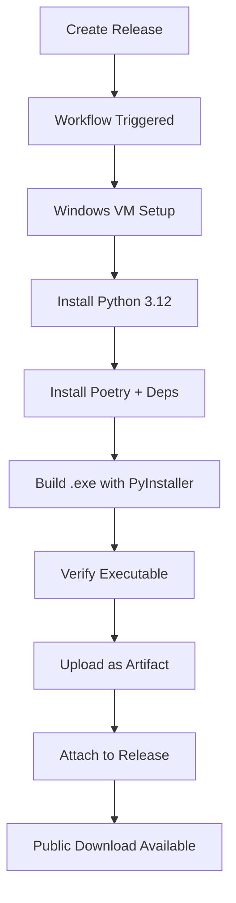

# 📁 .github Directory

This directory contains GitHub-specific configurations, workflows, and documentation for the Sheetwise project.

## 📂 Structure

```
.github/
├── workflows/                      # GitHub Actions workflows
│   ├── cd_workflow.yml            # CD: Build & Release automation
│   └── ci_workflow.yml            # CI: Tests and checks
│
├── copilot-instructions.md        # GitHub Copilot instructions
│
└── Release Documentation/         # Complete release system docs
    ├── RELEASE_QUICK.md           # 📊 Quick visual guide (START HERE!)
    ├── RELEASE_SETUP.md           # 📚 Complete setup guide
    ├── RELEASE_EXAMPLE.md         # 💡 Practical example
    ├── RELEASE.md                 # 🇧🇷 Portuguese instructions
    ├── RELEASE_EN.md              # 🇺🇸 English instructions
    ├── RELEASE_FAQ.md             # ❓ Frequently asked questions
    ├── release-template.md        # 📝 Release notes template
    └── release-drafter.yml        # ⚙️ Auto-draft configuration
```

## 🚀 Quick Start

**Want to create a release?** Read this order:

1. **[RELEASE_QUICK.md](RELEASE_QUICK.md)** - Visual overview (2 min read) ⭐
2. **[RELEASE_EXAMPLE.md](RELEASE_EXAMPLE.md)** - Step-by-step example (5 min)
3. **[RELEASE_FAQ.md](RELEASE_FAQ.md)** - Common questions

**Need detailed info?**
- 📚 [RELEASE_SETUP.md](RELEASE_SETUP.md) - Complete guide
- 🇧🇷 [RELEASE.md](RELEASE.md) - Em português
- 🇺🇸 [RELEASE_EN.md](RELEASE_EN.md) - In English

## 🤖 Workflows

### CD Workflow (cd_workflow.yml)
**Purpose:** Automatically build Windows executable on release

**Triggers:**
- ✅ When a release is created/published
- ✅ Manual trigger via Actions tab

**What it does:**
1. Sets up Windows environment
2. Installs Python 3.12 + Poetry
3. Installs all dependencies
4. Runs PyInstaller to build `Sheetwise_v1.exe`
5. Uploads executable as artifact (90 days)
6. Attaches `.exe` to the release

**Runtime:** ~5-10 minutes

### CI Workflow (ci_workflow.yml)
**Purpose:** Run tests and quality checks (if configured)

## 📝 Release Documentation Files

| File | Description | Language | Read Time |
|------|-------------|----------|-----------|
| `RELEASE_QUICK.md` | Visual quick guide with emojis | PT/EN | 2 min ⭐ |
| `RELEASE_SETUP.md` | Complete configuration guide | PT | 10 min |
| `RELEASE_EXAMPLE.md` | Practical step-by-step example | EN | 5 min |
| `RELEASE.md` | Release instructions | PT 🇧🇷 | 7 min |
| `RELEASE_EN.md` | Release instructions | EN 🇺🇸 | 7 min |
| `RELEASE_FAQ.md` | Frequently asked questions | PT | 8 min |
| `release-template.md` | Template for release notes | EN | 1 min |
| `release-drafter.yml` | Auto-draft config | - | - |

## 🎯 How to Create a Release

### Method 1: GitHub Web (Recommended)

```
1. Go to repository → Releases → "Draft a new release"
2. Fill: Tag (v1.0.0), Title, Description
3. Click "Publish release"
4. Wait 5-10 min for workflow to complete
5. Download Sheetwise_v1.exe from release assets
```

### Method 2: Command Line

```bash
# Create tag
git tag -a v1.0.0 -m "Release 1.0.0"
git push origin v1.0.0

# Then create release on GitHub web interface
```

## ✅ What Happens Automatically



## 📦 Release Assets

After workflow completes, release will have:
- ✅ `Source code (zip)`
- ✅ `Source code (tar.gz)`
- ✅ **`Sheetwise_v1.exe`** ← Windows executable!

## 🔍 Monitoring Builds

1. Go to **Actions** tab
2. Select **"CD - Build and Release"** workflow
3. Click on the run for your release
4. View logs for each step:
   - ✅ Checkout code
   - ✅ Set up Python
   - ✅ Install Poetry
   - ✅ Install dependencies
   - ✅ Build executable
   - ✅ Upload to release

## 🧪 Testing Without Release

You can test the workflow without creating a public release:

1. Go to **Actions**
2. Select **"CD - Build and Release"**
3. Click **"Run workflow"**
4. Select branch `main`
5. Click **"Run workflow"**

Executable will be available as **artifact** (not attached to any release).

## 📊 Versioning

Use **Semantic Versioning**:
- `v1.0.0` - First stable release
- `v1.1.0` - New feature (backwards compatible)
- `v1.1.1` - Bug fix
- `v2.0.0` - Breaking change

## 🔧 Troubleshooting

| Issue | Solution |
|-------|----------|
| Workflow not triggered | Create **release**, not just tag |
| Build failed | Check logs in Actions |
| .exe not appearing | Wait 5-10 min, refresh page |
| Missing dependencies | Verify `pyproject.toml` |
| Icon not found | Check `assets/icon.ico` exists |

## 📚 Additional Resources

- **Main README**: [../README.md](../README.md)
- **Quick Guide**: [../GUIDE.md](../GUIDE.md)
- **Portuguese Docs**: [../docs/pt_BR/](../docs/pt_BR/)
- **Build Scripts**: [../scripts/](../scripts/)

## 🎯 Quick Reference

**Create release:**
```bash
# Web: github.com/MarioCarvalhoBr/Sheetwise/releases/new
# CLI: gh release create v1.0.0 --title "..." --notes "..."
```

**Monitor build:**
```bash
# Web: github.com/MarioCarvalhoBr/Sheetwise/actions
```

**Download executable:**
```bash
# Web: github.com/MarioCarvalhoBr/Sheetwise/releases/latest
# Look for Sheetwise_v1.exe in Assets section
```

## 💡 Tips

1. **First time?** Read [RELEASE_QUICK.md](RELEASE_QUICK.md)
2. **Creating release?** Follow [RELEASE_EXAMPLE.md](RELEASE_EXAMPLE.md)
3. **Have questions?** Check [RELEASE_FAQ.md](RELEASE_FAQ.md)
4. **Need help?** See [RELEASE_SETUP.md](RELEASE_SETUP.md)

---

**Last updated:** October 2, 2025  
**Status:** ✅ Ready to use  
**Automated builds:** ✅ Configured
