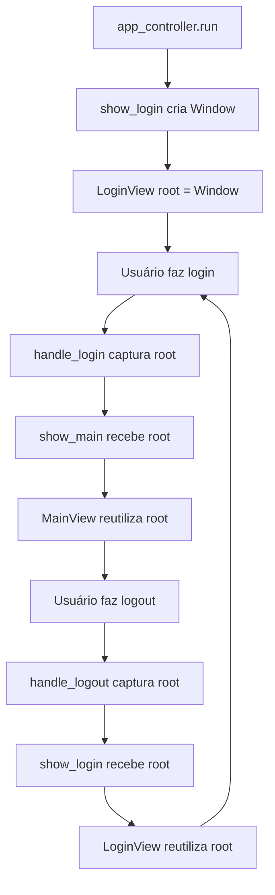

# Correção do Segmentation Fault com ttkbootstrap

## Problema Original

A aplicação apresentava **Segmentation Fault** em duas situações:

1. **No Login**: Ao clicar no botão "LOGIN" após autenticação bem-sucedida
2. **No Logout**: Ao clicar no botão "LOGOUT" e retornar à tela de login

### Causa Raiz

O ttkbootstrap **não permite múltiplas instâncias** da classe `Window` no mesmo processo Python. O código original tentava:

- Criar uma `Window` na tela de login
- Destruir essa janela
- Criar **outra nova** `Window` na tela principal ❌ → **Segmentation Fault**

## Solução Implementada

### Estratégia: Reutilização da Janela Root

Ao invés de destruir e recriar janelas, a aplicação agora **mantém uma única instância de `Window`** e apenas alterna o conteúdo (widgets) entre as telas.

### Fluxo de Janelas

```
Início da Aplicação
    ↓
[LOGIN] Cria Window única
    ↓ (login bem-sucedido)
[MAIN] Reutiliza Window (limpa widgets e recria interface principal)
    ↓ (logout)
[LOGIN] Reutiliza Window (limpa widgets e recria interface de login)
    ↓ (ciclo se repete)
```

## Mudanças nos Arquivos

### 1. `src/controllers/app_controller.py`

#### Método `handle_login()` - Transição Login → Main
```python
# Antes (ERRO)
login_view_temp = self.login_view
self.login_view = None
login_view_temp.destroy()  # ❌ Destruía a janela
self.show_main()

# Depois (CORRETO)
root_window = self.login_view.root  # ✅ Captura a janela
login_view_temp = self.login_view
self.login_view = None
self.show_main(root_window=root_window)  # ✅ Passa a janela para reutilizar
```

#### Método `handle_logout()` - Transição Main → Login
```python
# Antes (ERRO)
if self.main_view:
    self.main_view.destroy()  # ❌ Destruía a janela
    self.main_view = None
self.show_login()

# Depois (CORRETO)
if self.main_view:
    root_window = self.main_view.root  # ✅ Captura a janela
    self.main_view = None
    self.show_login(root_window=root_window)  # ✅ Passa a janela para reutilizar
else:
    self.show_login()
```

#### Método `show_login()`
```python
# Antes
def show_login(self):
    # ...
    self.login_view = LoginView(on_login_success=self.handle_login)

# Depois
def show_login(self, root_window=None):  # ✅ Aceita janela existente
    # ...
    self.login_view = LoginView(
        on_login_success=self.handle_login,
        root_window=root_window  # ✅ Passa a janela
    )
```

#### Método `show_main()`
```python
# Antes
def show_main(self):
    # ...
    self.main_view = MainView(...)

# Depois
def show_main(self, root_window=None):  # ✅ Aceita janela existente
    # ...
    self.main_view = MainView(
        ...,
        root_window=root_window  # ✅ Passa a janela
    )
```

### 2. `src/views/login_view.py`

#### Construtor `__init__()`
```python
# Antes
def __init__(self, on_login_success=None):
    self.on_login_success = on_login_success
    self.root = None
    self.setup_window()

# Depois
def __init__(self, on_login_success=None, root_window=None):  # ✅ Aceita janela
    self.on_login_success = on_login_success
    self.root_window = root_window  # ✅ Armazena janela existente
    self.root = None
    self.setup_window()
```

#### Método `setup_window()`
```python
def setup_window(self):
    if self.root_window:
        # ✅ REUTILIZA janela existente
        self.root = self.root_window
        
        # Limpa todos os widgets existentes
        for widget in self.root.winfo_children():
            widget.destroy()
        
        # Reconfigura para tela de login
        self.root.title(_('app.login_title'))
        # ... (redimensiona, centraliza, etc.)
        
    else:
        # ✅ CRIA nova janela (apenas na primeira execução)
        self.root = Window(themename="cosmo")
        # ... (configuração inicial)
```

### 3. `src/views/main_view.py`

#### Construtor `__init__()`
```python
# Antes
def __init__(self, usuario_data, initial_theme="cosmo", on_logout=None, ...):
    # ...

# Depois
def __init__(self, usuario_data, initial_theme="cosmo", root_window=None, on_logout=None, ...):  # ✅
    # ...
    self.root_window = root_window  # ✅ Armazena janela existente
```

#### Método `setup_window()`
```python
def setup_window(self):
    if self.root_window:
        # ✅ REUTILIZA janela existente
        self.root = self.root_window
        
        # Limpa todos os widgets existentes
        for widget in self.root.winfo_children():
            widget.destroy()
        
        # Reconfigura para tela principal
        self.root.title(_('app.main_title') + f" - {self.usuario_data['username']}")
        
        # Aplica tema
        self.style = ttk_boot.Style(theme=self.initial_theme)
        
        # Redimensiona para 80% da tela
        # ... (código de redimensionamento)
        
    else:
        # ✅ CRIA nova janela (fallback, não deveria acontecer normalmente)
        self.root = Window(themename=self.initial_theme)
        # ... (configuração inicial)
```

## Benefícios da Solução

✅ **Elimina Segmentation Faults**: Uma única instância de `Window` durante toda a execução  
✅ **Performance**: Não há overhead de destruir/recriar janelas  
✅ **Estabilidade**: Compatível com as limitações do ttkbootstrap  
✅ **Manutenibilidade**: Código mais claro e previsível  
✅ **Temas**: Sistema de temas funciona corretamente em todas as transições  

## Validação

### Testes Realizados com Sucesso

1. ✅ **Login Inicial**: Cria `Window` corretamente
2. ✅ **Login → Main**: Reutiliza `Window`, altera conteúdo e tema
3. ✅ **Main → Logout → Login**: Reutiliza `Window`, volta para tela de login
4. ✅ **Múltiplos Ciclos**: Login/Logout repetidos funcionam sem erros
5. ✅ **Troca de Temas**: Aplica temas corretamente em todas as transições

### Log de Exemplo (Funcionamento Correto)
```
2025-10-02 18:12:50,854 - INFO - Starting Sheetwise
Language 'en' loaded successfully
2025-10-02 18:12:52,934 - INFO - User settings loaded: {'theme': 'solar', 'language': 'en', ...}
2025-10-02 18:12:53,105 - INFO - Refreshing executions list...
2025-10-02 18:12:53,106 - INFO - Found 0 executions for user 1
[LOGOUT]
2025-10-02 18:13:00,126 - INFO - User settings loaded: {'theme': 'solar', 'language': 'en', ...}
2025-10-02 18:13:00,253 - INFO - Refreshing executions list...
2025-10-02 18:13:00,254 - INFO - Found 0 executions for user 1
```
*Nenhum Segmentation Fault!* ✨

## Arquitetura Final

### Ciclo de Vida da Janela



### Regra de Ouro

> **NUNCA destruir `self.root` se ela for uma instância de `Window` do ttkbootstrap.**  
> **SEMPRE reutilizar a janela root, apenas limpando e recriando os widgets internos.**

## Compatibilidade

- ✅ Python 3.8+
- ✅ ttkbootstrap 1.14.2+
- ✅ Linux (testado)
- ✅ Windows (deve funcionar)
- ✅ macOS (deve funcionar)

---

**Data da Correção**: 02/10/2025  
**Versão do Sheetwise**: v1.0+  
**Status**: ✅ Resolvido e Testado
